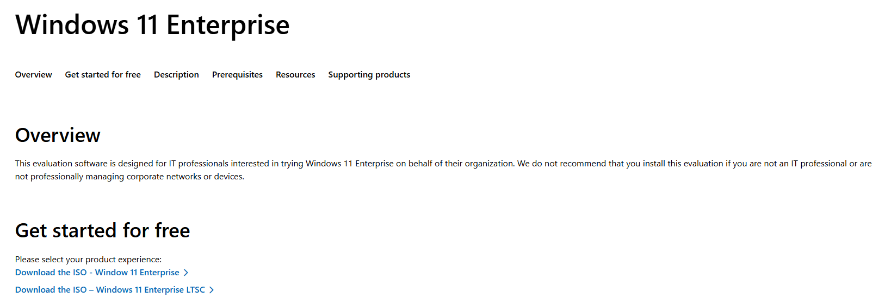
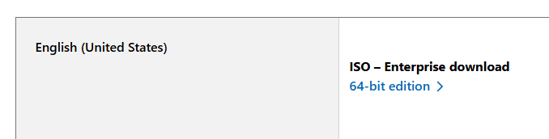

# Lab Architecture

## Endpoint Provisioning

A clean Windows 11 Enterprise virtual machine was deployed to act as the monitored endpoint for the incident response lab.

- Windows 11 Enterprise (Evaluation)
- 64-bit edition
- Single endpoint, standalone (non-domain joined)
- Intended to simulate a typical corporate workstation

The virtual machine was created from an official Microsoft ISO and installed without additional third-party software to preserve a clean baseline.

## Appendix: Endpoint Deployment Evidence

Windows 11 Enterprise deployment screenshots

